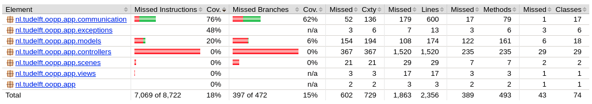
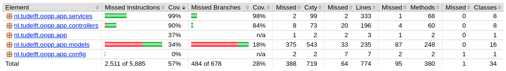

# Starting template

This README will need to contain a description of your project, how to run it, how to set up the development environment
, and who worked on it. This information can be added throughout the course, except for the names of the group members.
Add your own name (do not add the names for others!) to the section below.

## Description of project
This project repository contains an application, designed to improve the quality of online lectures
by allowing the students to ask questions to lecturers and vote on each other's questions in order to get
the most relevant ones answered. It consists of a server side REST API and a client side JFX application.

## Group members

| 📸 | Name | Email |
|---|---|---|
|  | Beatriz Barroso | B.MachadoGonzagaBarroso-1@student.tudelft.nl |
|  | Radoslav Sozonov | R.N.Sozonov@student.tudelft.nl |
|  | Pedro H. Brandão | P.H.BrandaodeAraujo@student.tudelft.nl |
|  | Natalia Pietnoczko | n.pietnoczko@student.tudelft.nl |
|  | Mauro Storti | m.storti@student.tudelft.nl |
|            | Rado Todorov | R.A.Todorov@student.tudelft.nl |

## How to run it
- First start the server application: server/src/main/java/nl/tudelft/oopp/app/ServerApplication.java
- Then start the client application: client/src/main/java/nl/tudelft/oopp/app/MainApp.java

#### To create a room:
- Write a room name into the "Create a new Room" box and click enter

#### To join a room:
- Insert the room link in the "Enter a Room box" and click enter
- Insert a nickname in the "Enter a NickName box"

#### To enter the administrator view:
- Insert the link "admin" in the "Enter a Room box" and click enter
- Enter the admin password in the "Enter the admin password" and click enter
- Standard admin password is "123"

## Test Coverage
Client: 
Server: 
## Copyright / License (opt.)
